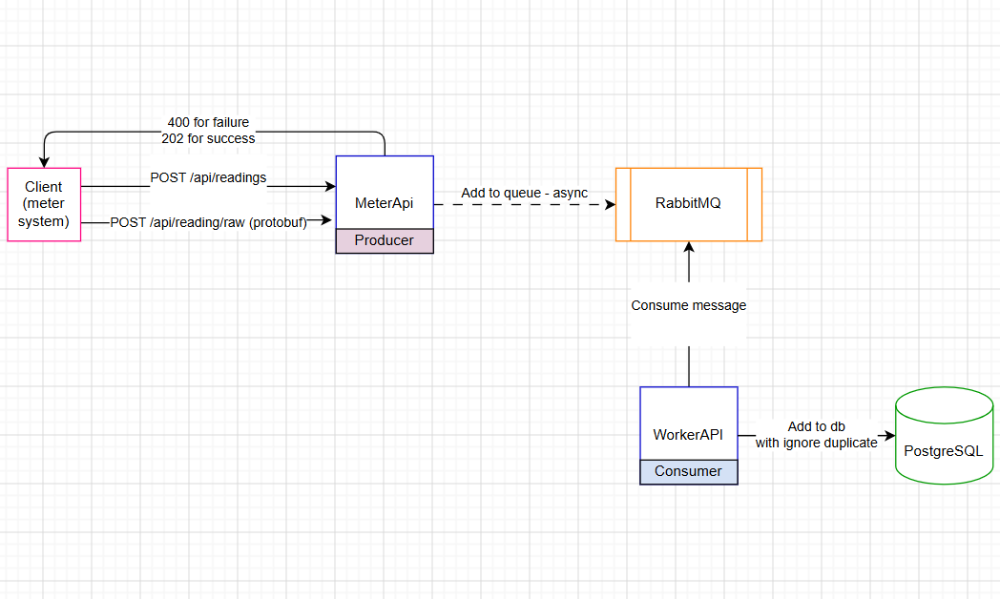

# Meter System

A backend system for receiving and processing meter readings asynchronously.

**Flow:** Client → REST API → RabbitMQ → Worker → PostgreSQL

## Prerequisites

- [Docker Desktop](https://www.docker.com/products/docker-desktop/)
- [Minikube](https://minikube.sigs.k8s.io/docs/start/)
- [.NET 10 SDK](https://dotnet.microsoft.com/download)
- Git Bash (included with [Git for Windows](https://git-scm.com/))

## Running the System

```bash
minikube start
bash deploy.sh
```

The script will:
1. Pull and load Docker images into Minikube
2. Deploy RabbitMQ and PostgreSQL
3. Apply the database schema
4. Build and deploy the API and Worker

## Accessing the API

```bash
minikube service metersystem-api
```

This opens the API in your browser. Navigate to `/swagger` to use the interactive UI.

## Testing

Send a POST request to `/api/readings`:

```json
{
  "meter_number": 12345,
  "readings": {
    "2026-03-18T10:15:00Z": 1234.56,
    "2026-03-18T10:00:00Z": 1234.51
  }
}
```

A `202 Accepted` response means the reading was queued successfully.

Or send a Base64-encoded protobuf payload to `/api/readings/raw`:

```json
{
  "meter_number": 12345,
  "data": "ChEKBgik9unNBhEK16NwPUqTQAoRCgYIoO/pzQYR16NwPQpKk0A="
}
```

## Verifying Data in PostgreSQL

```bash
kubectl exec -it deployment/postgres -- psql -U postgres -d meters -c "SELECT * FROM meters; SELECT * FROM meter_readings;"
```

## Design Notes

- **MeterSystem.Api** — chose a controller-based API over Minimal APIs for better readability, structure, and maintainability

- **deploy.sh** — replaced `minikube image pull` with `docker pull` + `minikube image load` because when using the Docker driver on Windows, Minikube containers may not always have external internet access; loading images through Docker is more reliable

- **MeterReadingWorker** — uses `ON CONFLICT DO NOTHING` when inserting readings to ensure idempotency; readings with the same meter and timestamp are ignored if already inserted

- **Shared MeterData model** — used a single shared model between the API and Worker services. A separate HTTP DTO layer could have been introduced, but since both structures are currently identical, a shared model kept the implementation simpler and easier to maintain

- **POST /api/readings/raw** — accepts a JSON payload containing a Base64-encoded protobuf message. The protobuf schema is defined in `Protos/meter_data.proto`, and the corresponding C# classes are generated automatically at build time using `Grpc.Tools`. After decoding and deserialization, the readings are converted into `MeterData` and published to the same RabbitMQ queue used by the standard endpoint.

## Architecture Diagram


